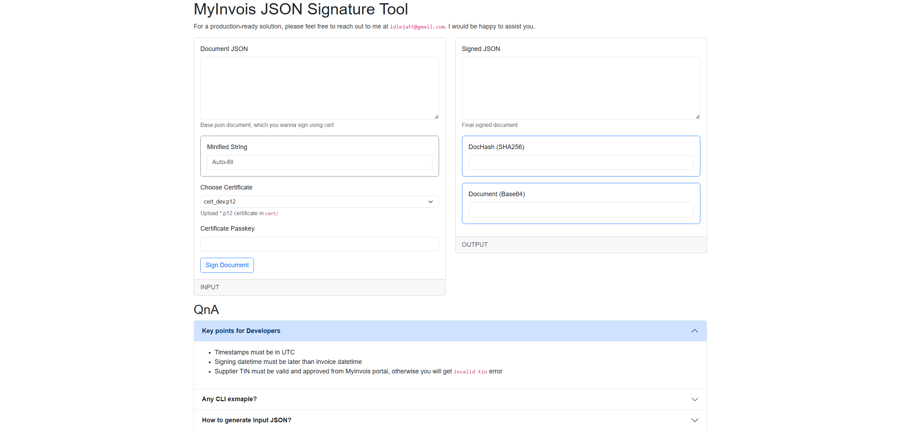

## MyInvois JSON Signature Tool
This repository simplifies the LHDN MyInvois JSON signature process. It helps generate and sign the required JSON documents for the new invoicing system. Additionally, a web application is included to make testing and using the process easier.

## CLI Script:
- Checkout signjson.py
- Alternatively, you can refer to EXAMPLE_IN_OTHER_LANG

## Contacts:
For a production-ready solution, please feel free to reach out to me at <code>idlejatt@gmail.com</code>. I would be happy to assist you.
